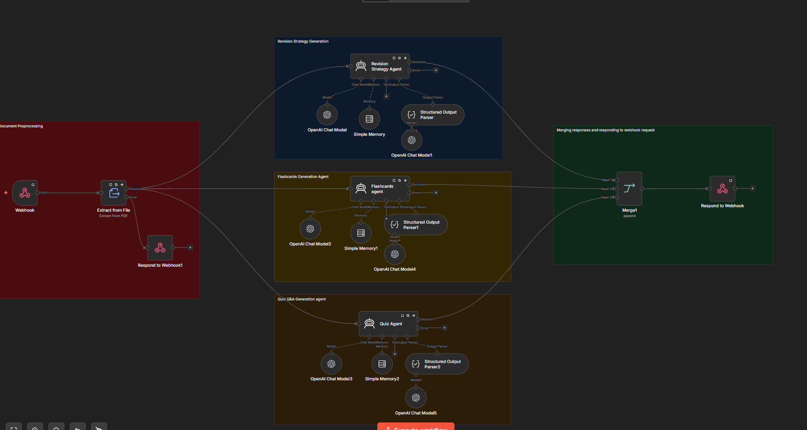
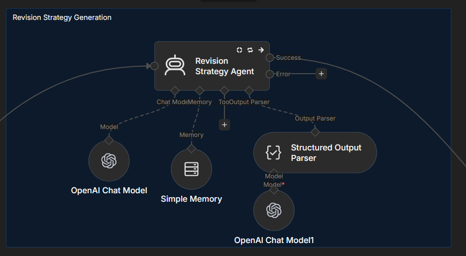
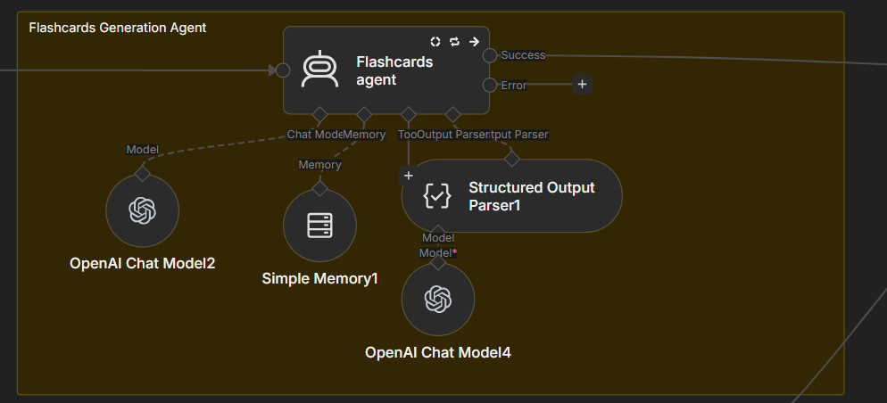
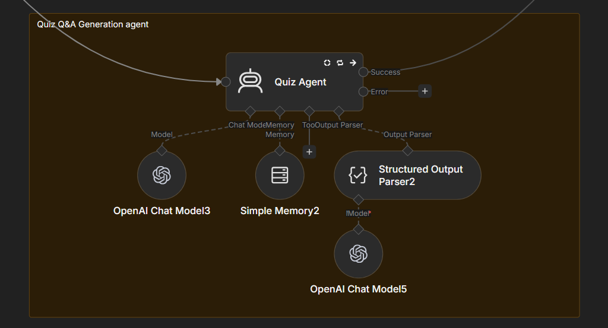

# Educational Materials Generation Workflow

This directory contains the configurations and extractions for the automated n8n workflow (`workflow.json`), which processes uploaded PDF documents to generate structured educational materials using parallel AI agents.

## Architecture & Workflow Steps

The workflow executes the following primary steps:
1. **Webhook Endpoint**: Listens for `POST` requests at `/react-app` containing a file payload.

2. **PDF Extraction**: Extracts raw text from the uploaded PDF binary data (`file` property). If the extraction fails, it automatically responds with a `422 Unprocessable Entity` ("Unable to process uploaded file").

3. **Parallel AI Processing**: The extracted text is sent concurrently to three specialized LangChain-powered AI agents (utilizing OpenAI models):
   - **Revision Strategy Agent**: Acts as an Academic Strategist. Generates a phase-based revision plan based on Cognitive Load Theory.
  
   - **Flashcards Agent**: Acts as a Memory Specialist. Extracts atomic facts and creates punchy flashcards with specific context hints to aid in recall.
   
   - **Quiz Agent**: Acts as an Educational Psychometrician. Generates a multiple-choice quiz ranging in difficulty, adhering to Bloom's Taxonomy. It provides distractors and pedagogical explanations for the correct answers.
   

4. **Merge and Respond**: The workflow uses structured output parsers to strictly conform the outputs of each agent to a predefined schema. The final JSON data is merged together and returned directly as the JSON payload to the initial webhook caller.

## Directory Structure

- `workflow.json`: The exported n8n workflow definition containing all node details, prompt structures, and routing logic.
- `schemas/`: Contains the strict JSON schemas enforced by the workflow's Structured Output Parsers.
  - `revision_schema.json`
  - `flashcards_schema.json`
  - `quiz_schema.json`
- `prompts/`: Contains the system messages/instructions provided to each AI agent.
  - `revision_agent_prompt.md`
  - `flashcards_agent_prompt.md`
  - `quiz_agent_prompt.md`

## Tooling 

- **n8n**: Used as the primary orchestration and pipeline tool.
- **LangChain Nodes**: Utilized in n8n for agentic memory, model querying, and enforcing structured JSON responses.

